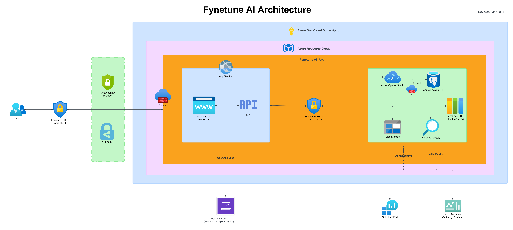
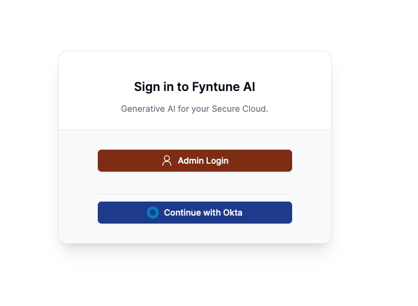

# Fynetune Terraform Setup

This repo serves as a terraform module to setup the infrastructure for Fynetune on Azure.

> _To use this repo, you can either clone it and run, or you can import it as a module in your terraform project._



## Resources

- **Resource Group**: To house all the other resources created by terraform.
- **Storage Account**: To store documents and other uploaded data securely.
- **Search Service**: To index and search documents.
- **Azure OpenAI**: To use and deploy OpenAI models.
- **Azure Postgres Flexible Server**: To store application data with a secure firewall.
- **App Service**: To host Fynetune application.

## Requirements

- **Azure CLI** or Environment Setup locally on the machine where you plan to run terraform.
- **Terraform** version 1.7.4 or higher.
- **Azure Account** with active subscription and necessary permissions.

## Setup Fynetune Infrastructure

As a part of setup process, we will assume that you already have azure cli setup is working locally and you have terraform installed.

### Step 1: Clone the repository

```bash
git clone https://github.com/Scale3-Labs/fynetune-terraform-azure.git
```

and navigate to the directory `fynetune-terraform-azure`

### Step 2: Setup Terraform Variables

To keep things simple, we have set values for most of the varaibles to minimal required. Modify `variables.tf` file to set the default values based on your requirements.

Most important variables are:

**fynetune_project**: This is the unique name of your deployment. It will be used to name all the resources created by terraform. So make sure it's unique as this will also be used in App Service URL and Azure Storage Account name.

**region**: The region where you want to deploy the resources. Default is `eastus`.

**github_release_tag**: The github release tag, you would find it in github release notes.

**postgres_admin_username** & **postgres_admin_password**: The username and password for the postgres server. Make sure to set a strong username and password.

### Step 3: Run Terraform

Run init to verify the terraform and install required moudules.

```bash
terraform init
```

Do a dry run on to see what resources will be created.

```bash
terraform plan
```

If you are prompted to input variables, make sure to input the required variables.

If you are happy with the plan, apply the changes.

```bash
terraform apply
```

It usually takes around 8 minutes for the resources to be created.
App service will take some time to be up and running.

Once the resources are created, you will see the output of the resources created.

```bash
Outputs:

app_service_url = "https://<fynetune_project>.azurewebsites.net"
```

### Step 4: Adding Models

Once the app is up and running, you can add the models to the app.

As of today, we support the following models:

| Model Name             | Environment Variables                                                                                                  |
| ---------------------- | ---------------------------------------------------------------------------------------------------------------------- |
| gpt-35-turbo           | `NEXT_PUBLIC_AZURE_OPENAI_GPT_35_TURBO_DEPLOYMENT_NAME`, `AZURE_OPENAI_GPT_35_TURBO_DEPLOYMENT_NAME`                   |
| gpt-35-turbo-16k       | `NEXT_PUBLIC_AZURE_OPENAI_GPT_35_TURBO_16K_DEPLOYMENT_NAME`, `AZURE_OPENAI_GPT_35_TURBO_16K_DEPLOYMENT_NAME`           |
| gpt-35-turbo-instruct  | `NEXT_PUBLIC_AZURE_OPENAI_GPT_35_TURBO_INSTRUCT_DEPLOYMENT_NAME`, `AZURE_OPENAI_GPT_35_TURBO_INSTRUCT_DEPLOYMENT_NAME` |
| gpt-4                  | `NEXT_PUBLIC_AZURE_OPENAI_GPT_4_DEPLOYMENT_NAME`, `AZURE_OPENAI_GPT_4_DEPLOYMENT_NAME`                                 |
| text-embedding-ada-002 | `NEXT_PUBLIC_AZURE_OPENAI_EMBEDDING_DEPLOYMENT_NAME`, `AZURE_OPENAI_EMBEDDING_DEPLOYMENT_NAME`                         |

- Open Azure Portal and navigate to Azure OpenAI or just search for OpenAI in the search bar.
- You will see a new resource with the name `<project-name>-ca`, click on it.
- Go to Model deployments section on the left and click 'Manage Deployments' button to open OpenAI Studio.
- Create a new deployment
  - Select the choice of model you want to deploy.
  - Keep model version to default (recommended).
  - Give a name to the deployment.
- Click create to deploy the model.

Once the model is created, next step is to add the right environment variables to the app service.

For the model you deployed, add the respective environment variables in the terraform config for `azurerm_linux_web_app` resource with name `fynetune_app_service` under the `app_settings` block in `main.tf` file

Example:

```hcl
  app_settings = merge(var.static_env_variables,
    {
      ...
      "NEXT_PUBLIC_AZURE_OPENAI_GPT_35_TURBO_DEPLOYMENT_NAME" = "gpt-35-turbo-deployment-name"
      ...
    }
  )
```

Once you have added it to config, run terraform apply again to update the app service with the new environment variables.

### Step 5: Signing in



- You may now sign in to the application by launching the output URL from the terraform apply.
- Use the root login if you haven't configured SSO
- Enter your license key at the prompt
- Refer to the environment variables below to further customize the application to meet your enterprise requirements.

## Reference Environment Variables

| Name                                                             | Description                                                                                                                                                                                                               | Default                                                                     |
| ---------------------------------------------------------------- | ------------------------------------------------------------------------------------------------------------------------------------------------------------------------------------------------------------------------- | --------------------------------------------------------------------------- |
| `ADMIN_PASSWORD`                                                 | Root email account when not using SSO. Highly recommended you change this after deploying.                                                                                                                                | `0q09q4v8lq6KIka4Ey7A`                                                      |
| `ADMIN_EMAIL`                                                    | Root password account when not using SSO. Highly recommended you change this after deploying.                                                                                                                             | `test@example.com`                                                          |
| `AZURE_OPENAI_EMBEDDING_MODEL_NAME`                              | Model name of the Azure Open AI deployment                                                                                                                                                                                | embed                                                                       |
| `AZURE_AISEARCH_API_VERSION`                                     | API version of Azure AI Search                                                                                                                                                                                            | `2023-10-01-Preview`                                                        |
| `AZURE_STORAGE_ACCOUNT`                                          | The account for the Azure Blob Storage. Used for storing files and documents.                                                                                                                                             | Defaults to the name of the project with “sa” suffix.                       |
| `AZURE_OPENAI_API_KEY`                                           | The API key for the OpenAI API. Used for LLM API requests.                                                                                                                                                                | Defaults to the name of the project with “ca” suffix.                       |
| `AZURE_AISEARCH_KEY`                                             | Azure AI Search key. Created at runtime.                                                                                                                                                                                  | Defaults to the name of the project with “-ss” suffix.                      |
| `AZURE_OPENAI_API_VERSION`                                       | Version of Azure OpenAI API                                                                                                                                                                                               | `2023-06-01-preview`                                                        |
| `AZURE_AISEARCH_ENDPOINT`                                        | The endpoint for the Azure AI Search API. Used for vector search.                                                                                                                                                         | Defaults to the name of the project with “-ss” suffix.                      |
| `AZURE_BLOB_CONNECTION_STRING`                                   | Primary Connection string of the Azure storage account                                                                                                                                                                    | Derived from the name of the storage account.                               |
| `AZURE_OPENAI_URL`                                               | URL of the AI OpenAI endpoint                                                                                                                                                                                             | Derived from project name.                                                  |
| `HOSTING_PLATFORM`                                               | Cloud provider hosting the Fynetune deployment                                                                                                                                                                            | Azure                                                                       |
| `LICENSE_PUBLIC_KEY`                                             | Public key for the license file                                                                                                                                                                                           |                                                                             |
| `MATOMO_URL`                                                     | The URL endpoint for Matomo analytics services.                                                                                                                                                                           | `https://example.matomo.cloud/`                                             |
| `MATOMO_ID`                                                      | The unique identifier or ID associated with the Matomo analytics account                                                                                                                                                  | 1                                                                           |
| `NEXT_PUBLIC_AZURE_OPENAI_API_KEY`                               | Same as `AZURE_OPENAI_API_KEY` used by Fynetune client.                                                                                                                                                                   |                                                                             |
| `NEXT_PUBLIC_AZURE_OPENAI_MODEL_API_ENDPOINT`                    | The endpoint for the OpenAI GPT-3 model. Used for LLM API requests.                                                                                                                                                       |                                                                             |
| `NEXT_PUBLIC_APP_DOMAIN`                                         | URL of the Azure app service webiste. You may change this to a custom domain with a CNAME after deployment.                                                                                                               | Derived from a concatenation of “projectname” and “-app.azurewebsites.net”. |
| `NEXT_PUBLIC_AZURE_AISEARCH_ENDPOINT`                            | The endpoint for the Azure AI Search API. Used for vector search.                                                                                                                                                         | Defaults to the name of the project with “-ss” suffix.                      |
| `NEXTAUTH_URL`                                                   | The URL of the NextAuth.js authentication provider, used for authentication and authorization purposes in the application.                                                                                                | Derived from project name                                                   |
| `NEXTAUTH_URL_INTERNAL`                                          | Internal URL used by NextAuth.js for authentication and authorization operations within the application's backend or infrastructure.                                                                                      | Derived from project name                                                   |
| `NEXT_PUBLIC_AZURE_STORAGE_ACCOUNT`                              | Azure Storage Account name used for storing and managing application data or assets in Azure cloud storage.                                                                                                               | Derived from project name                                                   |
| `NEXT_PUBLIC_HOST`                                               | Public host or domain name where the application is hosted or accessible to users.                                                                                                                                        | Derived from project name                                                   |
| `NEXT_PUBLIC_AZURE_OPENAI_API_VERSION`                           | Version of the Azure OpenAI API used by the application for natural language processing or AI-related functionalities.                                                                                                    | `2023-06-01-preview`                                                        |
| `NEXT_PUBLIC_AZURE_OPENAI_EMBEDDING_DEPLOYMENT_NAME`             | Deployment name or identifier for the Azure OpenAI embedding model used by the application.                                                                                                                               | embed                                                                       |
| `NEXT_PUBLIC_POSTGRES_HOST`                                      | Hostname or IP address of the PostgreSQL database server used by the application for data storage and management.                                                                                                         | Defaults to the name of the project with “-pg” suffix.                      |
| `NEXT_PUBLIC_AZURE_AISEARCH_API_VERSION`                         | Version of the Azure AI Search API integrated into the application for search functionality.                                                                                                                              | `2023-10-01-Preview`                                                        |
| `NEXT_PUBLIC_AZURE_OPENAI_GPT_35_TURBO_DEPLOYMENT_NAME`          | Deployment name or identifier for the Azure OpenAI GPT-3.5 Turbo model used by the application for text generation or AI tasks.                                                                                           |                                                                             |
| `NEXT_PUBLIC_AZURE_OPENAI_GPT_4_DEPLOYMENT_NAME`                 | Deployment name or identifier for the Azure OpenAI GPT-4 model integrated into the application.                                                                                                                           |                                                                             |
| `NEXT_PUBLIC_AZURE_OPENAI_GPT_35_TURBO_16K_DEPLOYMENT_NAME`      | Deployment name or identifier for the Azure OpenAI GPT-3.5 Turbo 16K model used by the application.                                                                                                                       |                                                                             |
| `NEXT_PUBLIC_AZURE_OPENAI_GPT_35_TURBO_INSTRUCT_DEPLOYMENT_NAME` | Deployment name or identifier for the Azure OpenAI GPT-3.5 Turbo Instruct model integrated into the application.                                                                                                          |                                                                             |
| `NEXT_PUBLIC_APP_NAME`                                           | Name of the application, used for branding or identification purposes within the application environment.                                                                                                                 | Fynetune AI                                                                 |
| `OKTA_ISSUER`                                                    | The issuer URL provided by Okta, which serves as the base URL for authentication requests and token validation. It is used by the application to verify tokens and authenticate users against the Okta identity provider. | `https://dev-123456.okta.com/oauth2/default`                                |
| `OKTA_CLIENT_SECRET`                                             | Secret key or token used by the Okta authentication provider for secure communication and authentication purposes.                                                                                                        | `Test0q09q4v8lq6K7A`                                                        |
| `OKTA_CLIENT_ID`                                                 | Client ID or identifier assigned by Okta for authenticating the application and users accessing the system.                                                                                                               | `0oaz5`                                                                     |
| `POSTGRES_HOST`                                                  | Hostname or IP address of the PostgreSQL database server used by the application for data storage and management.                                                                                                         | Defaults to the name of the project with “-pg” suffix                       |
| `POSTGRES_USER`                                                  | Username or role name used to authenticate and access the PostgreSQL database.                                                                                                                                            | `fynetuneadmin`                                                             |
| `POSTGRES_PASSWORD`                                              | Password associated with the PostgreSQL user account for authentication and database access.                                                                                                                              | `0q09q4v8lq6KIka4Ey7A`                                                      |
| `POSTGRES_URL_NO_SSL`                                            | PostgreSQL database connection URL without SSL encryption enabled.                                                                                                                                                        | Derived from `POSTGRES_URL`                                                 |
| `POSTGRES_PRISMA_URL  `                                          | URL used by Prisma ORM to connect and interact with the PostgreSQL database.                                                                                                                                              | Derived from `POSTGRES_URL`                                                 |
| `POSTGRES_URL_NON_POOLING`                                       | PostgreSQL database connection URL configured without connection pooling for specific database access requirements.                                                                                                       | Derived from `POSTGRES_URL`                                                 |
| `POSTGRES_DATABASE`                                              | Name of the PostgreSQL database used by the application to store and manage data.                                                                                                                                         | fynetunedb                                                                  |
| `POSTGRES_URL`                                                   | PostgreSQL database connection URL, including necessary authentication parameters and database details.                                                                                                                   | Derived from `POSTGRES_DATABASE`                                            |
| `SPLUNK_ORG_TOKEN`                                               | Organization token or identifier used for authenticating and accessing the Splunk logging and monitoring service.                                                                                                         | `TestGklPgDgd1w`                                                            |
| `SPLUNK_REALM`                                                   | Realm or environment identifier used by Splunk for data indexing, storage, and analysis in specific deployment environments.                                                                                              | `us1`                                                                       |
| `SPLUNK_URL`                                                     | URL endpoint or address for accessing the Splunk service, including logging and monitoring functionalities.                                                                                                               | `https://test.us1.signalfx.com/v2/datapoint`                                |
|                                                                  |                                                                                                                                                                                                                           |                                                                             |
